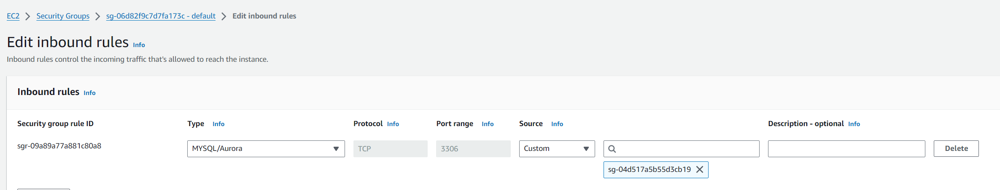

# Project Overview

This project deploys two virtual machines across different availability zones, with an RDS database. It utilizes Ansible to install MySQL and WordPress on the virtual machines. For credential management, Ansible Vault is used. This setup requires minimal manual intervention, such as ensuring the default VPC security group has an inbound rule with the new security group `wordpress-2-sg`.

## Configuration Steps

### Update Security Group Settings

Ensure the default VPC security group has an inbound rule associated with the newly created `wordpress-2-sg` group:

- **Type**: MYSQL/Aurora
- **Protocol**: TCP
- **Port**: 3306
- **Source**: `wordpress-2-sg`



### Manage Secrets with Ansible Vault

If necessary, create a new `secret_vars.yml` file:

```bash
ansible-vault create secret_vars.yml
```

Inside the file, include variables like the following:

```yaml
db_host: "host"
db_password: "MasterPassword"
```

### Running Ansible

Execute Ansible with a vault password:

```bash
ansible-playbook -i inventory.ini setup_wordpress.yml --ask-vault-pass
```

Alternatively, use a vault password file:

```bash
ansible-playbook -i inventory.ini setup_wordpress.yml --vault-password-file /path/to/vault_password_file
```

### Update Inventory Settings

Make sure to update the hosts' IPs and public key paths in `ansible/inventory.ini`.

### Execution Platforms

- **Terraform**: Run from Windows or through GitHub Actions.
- **Ansible**: Run from a Linux machine.
```

This README provides a clear overview of the project setup and step-by-step instructions for configuration and deployment, maintaining a professional and clean formatting style suitable for GitHub.